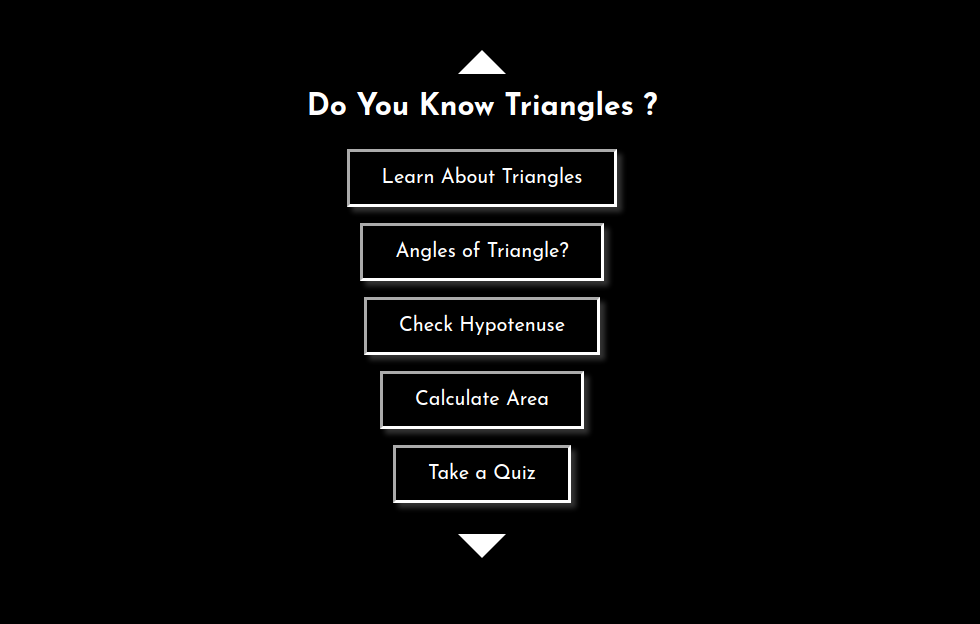

# neoG - Mark-12 Fun with Triangles

This is a solution to the [Mark-12 of neoG camp](https://neog.camp/guide/mark-12).

## Table of contents

- [Overview](#overview)
  - [The challenge](#the-challenge)
  - [Screenshot](#screenshot)
  - [Links](#links)

## Overview
- In this app, learn about triangles, take a quiz about triangles or calculate the hypotenuse and area of a triangle

### The challenge

- Ask the user to input three angles and you say whether the angles make a triangle or not.
- Prepare a Quiz and enable the user to play the quiz and calculate scores based on the answers chosen by the user.
- Calculate hypotenuse of a triangle given the other two sides
- Calculate area of a triangle given the base and height of a triangle
### Screenshot

### Links

[- Live Site URL](https://git-0r.github.io/mark12_triangles/)
